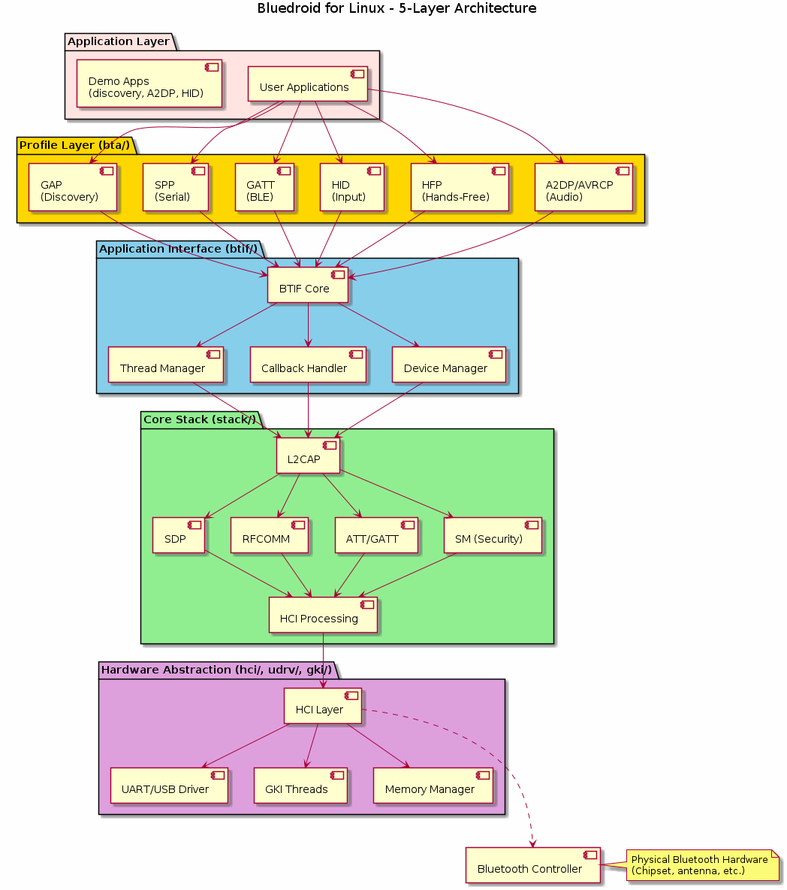
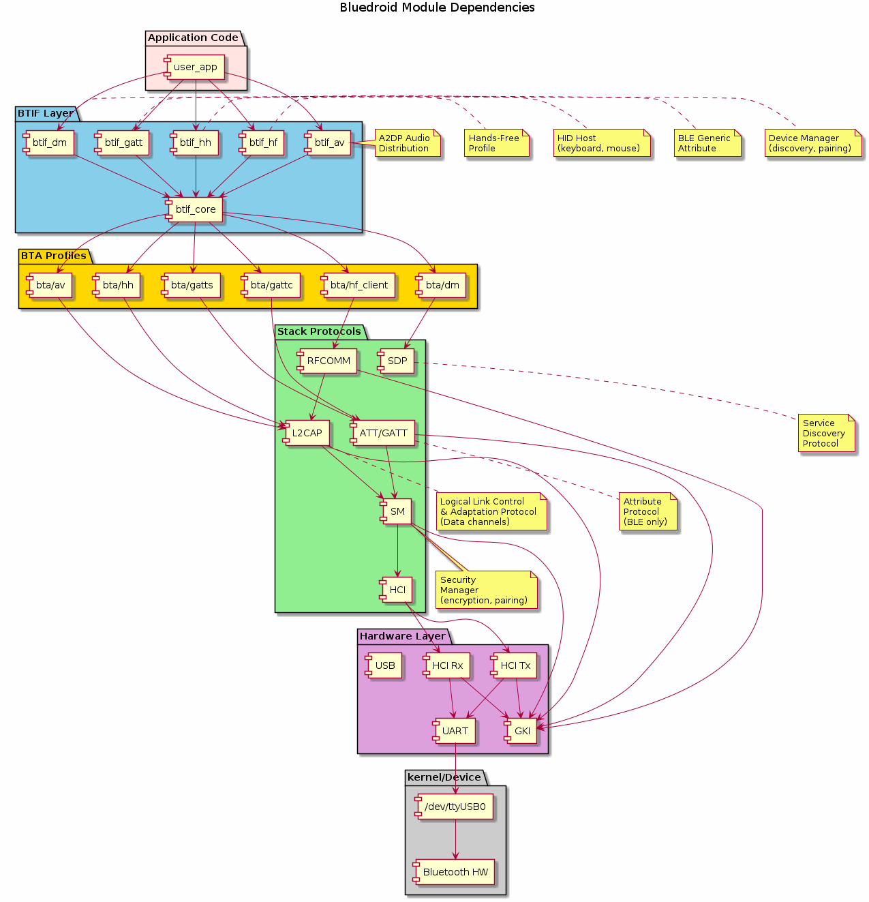
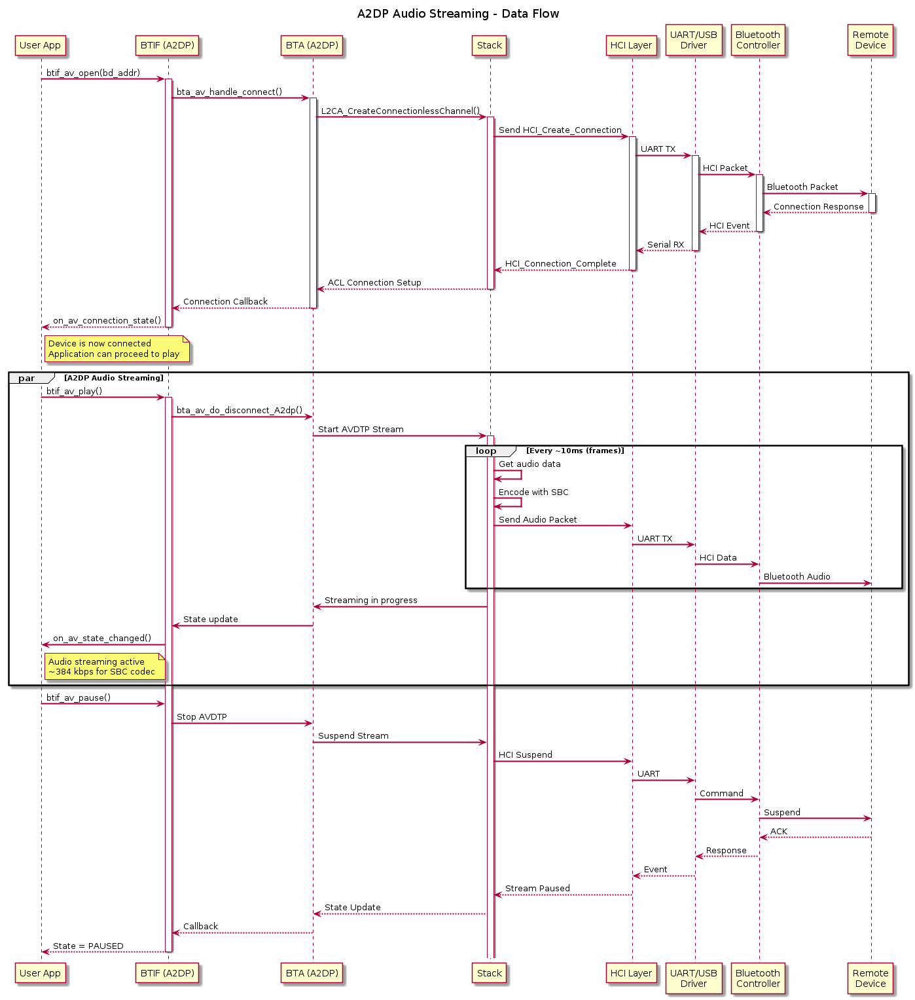

# BlueLinux

[](LICENSE)
[]()
[]()
[]()
[]()
[](https://github.com/nikhiloz/BlueLinux/stargazers)
[](https://github.com/nikhiloz/BlueLinux/actions)

A modern, modular Bluetooth stack for Linux systems based on the Bluedroid architecture. BlueLinux brings professional-grade Bluetooth support to embedded and desktop Linux platforms, featuring both Classic Bluetooth and Bluetooth Low Energy (BLE) protocols with comprehensive documentation and examples.

## Overview

BlueLinux is a comprehensive, production-ready Bluetooth stack designed for embedded and desktop Linux systems. It provides a modular architecture with clear separation of concerns, making it ideal for custom Bluetooth applications, system integration, IoT devices, and educational purposes.

**Status:** Modern codebase with comprehensive CI/CD, documentation, and examples.

## Features

- **Dual-Mode Support:** Classic Bluetooth and BLE
- **Modular Architecture:** Clean separation between profiles, stack, and hardware layers
- **Multiple Profile Support:**
  - A2DP (Advanced Audio Distribution Profile) - Audio streaming
  - AVRCP (Audio/Video Remote Control Protocol) - Media control
  - HFP (Hands-Free Profile) - Voice calls
  - HID (Human Interface Device) - Keyboards, mice, joysticks
  - SPP (Serial Port Profile) - Serial communication
  - GATT (Generic Attribute Profile) - BLE services
  - GAP (Generic Access Profile) - Discovery and connection
  - And more...

- **Multiple Build Systems:** CMake and Makefile support
- **Hardware Abstraction:** Pluggable HCI drivers and platform layers

## Architecture

```
BlueLinux/
├── stack/              # Core Bluetooth stack (L2CAP, SDP, RFCOMM)
├── bta/                # Bluetooth application layer (profiles)
├── btif/               # Bluetooth interface (bridge between stack and applications)
├── hci/                # Host Controller Interface (hardware communication)
├── hardware/           # Hardware abstraction & drivers
├── udrv/               # Unified driver layer
├── gki/                # Generic Kernel Interface (threading/OS abstraction)
├── audio_a2dp_hw/      # A2DP audio processing
├── embdrv/             # Embedded drivers (codec implementations)
├── include/            # Header files and API definitions
├── conf/               # Configuration files
├── tools/              # Utility tools and diagnostics
├── test/               # Test suites and examples
└── utils/              # Utility functions
```

### Module Hierarchy

1. **Hardware Layer (bottom)**
   - `hardware/` - Device-specific code (UART, USB, etc.)
   - `udrv/` - Unified driver interface
   - `hci/` - HCI packet processing and device communication

2. **Core Stack Layer**
   - `stack/` - L2CAP (Link Layer), SDP (Service Discovery), RFCOMM, etc.
   - `gki/` - OS abstraction and threading model

3. **Application Interface Layer**
   - `btif/` - Bridge between stack and application-level profiles
   - Handles thread management and queue communication

4. **Profile Layer (top)**
   - `bta/` - Implementations of BT profiles (A2DP, AVRCP, HFP, HID, etc.)
   - Profile-specific state machines and logic

5. **Audio & Codec Support**
   - `audio_a2dp_hw/` - A2DP audio sink/source implementation
   - `embdrv/sbc/encoder` - SBC codec for audio compression

## System Architecture Diagrams

### 5-Layer Architecture Overview

This visual representation shows how the system is organized into distinct, independent layers:



**Layer Explanation:**
1. **Application** - User code using the Bluetooth stack
2. **Profile** (bta/) - Bluetooth protocol implementations (A2DP, HFP, HID, GATT)
3. **Interface** (btif/) - Bridge connecting profiles to stack
4. **Core Stack** (stack/) - Protocol processing (L2CAP, SDP, RFCOMM, ATT)
5. **Hardware** (hci/, udrv/, gki/) - Device communication and OS abstraction

### Module Dependencies

All modules and their relationships:



### A2DP Audio Streaming Data Flow

Example of how audio data flows through the system:



## Quick Integration Examples

### Example 1: Device Discovery

```c
#include <btif/btif_api.h>

// Callback for discovered devices
void on_discovery_complete(int num_devices, bt_device_t *devices) {
    for (int i = 0; i < num_devices; i++) {
        printf("Found: %s [%02x:%02x:%02x:%02x:%02x:%02x] RSSI: %d\n",
               devices[i].name,
               devices[i].address.address[0],
               devices[i].address.address[1],
               devices[i].address.address[2],
               devices[i].address.address[3],
               devices[i].address.address[4],
               devices[i].address.address[5],
               devices[i].rssi);
    }
}

int main() {
    btif_init();
    btif_enable();
    
    // Register callback
    btif_dm_register_discovery_callback(on_discovery_complete);
    
    // Start 12-second discovery scan
    start_discovery();
    sleep(12);
    cancel_discovery();
    
    btif_disable();
    return 0;
}
```

**Compilation:**
```bash
gcc -I./include discovery_example.c -o discovery \
    -L./build/lib -lbluedroid -lpthread
./discovery
```

### Example 2: A2DP Audio Connection & Playback

```c
#include <btif/btif_api.h>
#include <stdio.h>
#include <unistd.h>

void on_av_connection_state(bt_connection_state_t state, bt_bdaddr_t *addr) {
    printf("Audio device connection: %s\n", 
           state == BT_ACL_STATE_CONNECTED ? "Connected" : "Disconnected");
}

int main() {
    bt_bdaddr_t remote = {
        .address = {0xAA, 0xBB, 0xCC, 0xDD, 0xEE, 0xFF}
    };
    
    btif_init();
    btif_enable();
    
    // Register connection callback
    btif_dm_register_connection_callback(on_av_connection_state);
    
    // Open A2DP connection
    printf("Connecting to audio device...\n");
    btif_av_open(&remote);
    sleep(2);  // Wait for connection
    
    // Start audio playback
    printf("Starting playback...\n");
    btif_av_play();
    sleep(10);  // Stream for 10 seconds
    
    // Pause
    printf("Pausing...\n");
    btif_av_pause();
    sleep(2);
    
    // Resume
    printf("Resuming...\n");
    btif_av_play();
    sleep(5);
    
    // Disconnect
    printf("Stopping...\n");
    btif_av_close();
    
    btif_disable();
    return 0;
}
```

### Example 3: HID Device (Keyboard/Mouse)

```c
#include <btif/btif_api.h>

void on_hid_input_report(bt_bdaddr_t *addr, const uint8_t *data, int length) {
    printf("HID Report: ");
    for (int i = 0; i < length; i++) {
        printf("%02x ", data[i]);
    }
    printf("\n");
}

int main() {
    bt_bdaddr_t keyboard_addr = {
        .address = {0x11, 0x22, 0x33, 0x44, 0x55, 0x66}
    };
    
    btif_init();
    btif_enable();
    
    // Connect to HID device
    printf("Connecting to keyboard...\n");
    btif_hh_connect(&keyboard_addr);
    sleep(2);
    
    // Listen for input for 30 seconds
    printf("Listening for keyboard input...\n");
    sleep(30);
    
    // Disconnect
    btif_hh_disconnect(&keyboard_addr);
    btif_disable();
    return 0;
}
```

### Example 4: GATT BLE Server/Client

```c
#include <btif/btif_api.h>

void on_gatt_server_connect(bt_bdaddr_t *addr) {
    printf("GATT Client connected: %02x:%02x:%02x:%02x:%02x:%02x\n",
           addr->address[0], addr->address[1], addr->address[2],
           addr->address[3], addr->address[4], addr->address[5]);
}

int main() {
    btif_init();
    btif_enable();
    
    // Start BLE advertising
    printf("Starting BLE advertisement...\n");
    btif_gatts_start_service_advertise();
    
    // Register GATT server callbacks
    btif_gatts_register_server_callback(on_gatt_server_connect);
    
    // Wait for connections
    printf("Waiting for BLE client connections...\n");
    sleep(60);
    
    // Stop advertising
    btif_gatts_stop_service_advertise();
    btif_disable();
    return 0;
}
```

## Building


### Prerequisites

- GCC/Clang compiler
- CMake 3.10+ or GNU Make
- Linux headers (for HCI socket interface)
- ALSA development libraries (for audio features)
- pthread library

### Build with CMake (Recommended)

```bash
mkdir build && cd build
cmake ..
make -j$(nproc)
```

### Build with Makefile

```bash
make -j$(nproc)
```

### Build Specific Components

```bash
# Build with verbose output
make VERBOSE=1

# Build only core stack
make stack

# Build with debug symbols
make DEBUG=1
```

## Testing

```bash
# Run test suite
make test

# Run specific test
./build/test/test_l2cap
./build/test/test_hci

# Manual HCI testing
./tools/hcitool
```

## API Overview

### Core Stack API

#### Device Initialization

```c
// Initialize Bluetooth device
bt_status_t btif_init(void);

// Enable Bluetooth
bt_status_t btif_enable(void);

// Disable Bluetooth
bt_status_t btif_disable(void);
```

#### Device Discovery

```c
// Start inquiry scan
bt_status_t start_discovery(void);

// Stop inquiry scan
bt_status_t cancel_discovery(void);

// Set discoverable mode
bt_status_t set_discoverable(uint8_t discoverable);
```

#### Connection Management

```c
// Remote device connection
bt_status_t create_bond(bt_bdaddr_t *bd_addr);

// Disconnect
bt_status_t disconnect(bt_bdaddr_t *bd_addr);

// Get connection state
bt_connection_state_t get_connection_state(bt_bdaddr_t *bd_addr);
```

#### Profile APIs (Located in `bta/` subdirectories)

- **A2DP:** `bta/av/` - Audio streaming control
- **AVRCP:** `bta/rc/` - Remote control
- **HFP:** `bta/hf_client/` - Hands-free device
- **HID:** `bta/hh/` - Input device handling
- **SPP:** `bta/dm/` - Serial profile

### Configuration

Edit `conf/bt_config.txt` to customize:
```
BtSnoopLogOutput=false
BtuStackDebugBtsnoop=false
EnableBtSnoop=true
BtSnoopFileName=/var/log/bluetooth/btsnoop.log
```

## Known Limitations

1. **Legacy Codebase:** Last synchronized with Android 6.0+ codebase
2. **Build System:** CMake integration may require modernization for recent versions
3. **Deprecated APIs:** Some APIs follow older Bluetooth specifications
4. **Limited Documentation:** Original Android documentation may not apply directly
5. **Platform Support:** Tested primarily on older Linux kernel versions (3.x–4.x)
6. **No Active Upstream:** Not synchronized with latest Android Bluetooth stack changes

## TODO / Future Work

- [ ] Update to modern Bluetooth 5.1+ specifications
- [ ] Migrate deprecated HCI interfaces to modern kernel interfaces
- [ ] Add comprehensive unit tests and CI/CD pipeline
- [ ] Performance optimization and memory profiling
- [ ] BLE Extended Advertisement support
- [ ] Dynamic profile loading
- [ ] Enhanced logging and debugging tools
- [ ] Docker support for isolated testing
- [ ] Example applications and tutorials
- [ ] API documentation (Doxygen)

## Usage Examples & Runnable Demos

This repository includes fully functional example applications in the `examples/` directory that demonstrate key features:

### Available Examples

1. **[device_discovery.c](examples/device_discovery.c)**
   - Device scanning and enumeration
   - Discover nearby Bluetooth devices
   - Display device information (address, name, RSSI, class of device)
   ```bash
   cd examples
   gcc -I../include device_discovery.c -o discovery_demo
   ./discovery_demo
   ```

2. **[a2dp_audio.c](examples/a2dp_audio.c)**
   - Audio device connection
   - A2DP stream management (play/pause/stop)
   - Audio codec negotiation (SBC)
   - Connection state tracking
   ```bash
   gcc -I../include a2dp_audio.c -o a2dp_demo
   ./a2dp_demo
   ```

3. **[hid_device.c](examples/hid_device.c)**
   - HID device connections (keyboard, mouse, joystick)
   - Input report handling
   - Device capability detection
   - Battery level monitoring
   ```bash
   gcc -I../include hid_device.c -o hid_demo
   ./hid_demo
   ```

### Integration in Your Application

Detailed integration examples are provided above in the "[Quick Integration Examples](#quick-integration-examples)" section, including:
- Device discovery and pairing
- A2DP audio streaming
- HID device control
- GATT BLE server/client

### Advanced Configurations

For more complex scenarios, see:
- [DEVELOPMENT.md](docs/DEVELOPMENT.md) - Development setup and debugging
- [API_REFERENCE.md](docs/API_REFERENCE.md) - Complete API documentation
- [ARCHITECTURE.md](docs/ARCHITECTURE.md) - System design details

## Troubleshooting


### HCI Communication Issues
- Verify Bluetooth hardware: `hciconfig -a`
- Check kernel Bluetooth drivers: `lsmod | grep bluetooth`
- Enable HCI debugging: Set `BtuStackDebugBtsnoop=true` in config

### Compilation Errors
- Ensure all headers in `include/` are accessible
- Check for missing pthread/ALSA libraries: `pkg-config --cflags alsa`
- Verify GCC version supports C99+ features

### Runtime Crashes
- Enable debug symbols: `make DEBUG=1`
- Use valgrind for memory issues: `valgrind ./bt_daemon`
- Check system logs: `dmesg | grep -i bluetooth`

## Contributing

Contributions are welcome! Areas of interest:
- Modernization of build system
- Support for newer Bluetooth specifications
- Bug fixes and performance improvements
- Documentation and examples
- Platform-specific optimizations

Please open an issue or submit a pull request with:
- Clear description of changes
- Test cases for new features
- Updated documentation

## License

[To be specified - check original Android Bluedroid license requirements]

## References

- [Bluetooth SIG Official Specifications](https://www.bluetooth.com/specifications/)
- [Android Open Source Project - Bluedroid](https://android.googlesource.com/platform/system/bt/)
- [Linux Bluetooth Stack (BlueZ)](http://www.bluez.org/)

## Support & Community

- Issues: GitHub Issues tracker
- Discussions: GitHub Discussions
- Related Projects: See [Bluetooth_Notes](https://github.com/nikhiloz/Bluetooth_Notes) for additional documentation

---

**Last Updated:** February 2026  
**Maintainer:** nikhiloz  
**Status:** Legacy - Seeking active contributors for modernization
